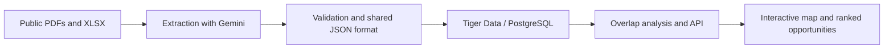

# GridLock

Find coordination opportunities across electric utilities' construction plans.

GridLock is a four-person, approximately 12-hour hackathon project for the
**Sperry Tech + Gemini API + Tiger Data** tracks. It aims to compare public plans
from Dominion Energy South Carolina and Georgia Power, highlight nearby projects,
and help users investigate opportunities to share resources and infrastructure.

## Current status

The Tiger Cloud PostgreSQL/PostGIS schema and versioned JSON importer are
implemented. The backend serves `GET /health`, `GET /projects`, and
`GET /opportunities`, with CORS enabled for a browser frontend
(`GRIDLOCK_CORS_ORIGINS`). Tiger Cloud contains the 166-record master batch:
24 validated Dominion records and 6 validated Georgia Power records (of 122),
after OSM/HIFLD location enrichment for Georgia terminals. `/opportunities`
is expected to still return empty — the closest validated cross-utility pair
is roughly 34 miles apart, over the 25-mile boundary.

A React + Tailwind + Leaflet frontend (`frontend/`) is implemented: a map of
both utilities' projects, the ranked opportunity list, a filterable project
list, and a detail panel with source evidence. Deployment is not set up yet.
Gemini extraction code exists; its integration into the complete demo still
needs verification. The features below describe the intended complete MVP.

## Planned MVP

- An interactive map showing planned projects from both utilities.
- Geographic overlap detection for cross-utility projects within 25 miles.
- Construction timeline comparison as a secondary coordination signal.
- A ranked list of opportunities with source evidence and visible uncertainty.

A rough cost or impact estimate for one opportunity is a stretch goal. A flagged
pair indicates a potential opportunity, not proof that resource sharing is feasible.

## Selected tracks

| Track | Intended role |
| --- | --- |
| Sperry Tech | Defines the utility coordination problem and required outcomes |
| Gemini API | Helps extract structured project information from public documents; may explain validated results |
| Tiger Data | Stores project records in PostgreSQL and supports queries for analysis and the interface |

Gemini output will be checked against source evidence. Distances and rankings will
be calculated deterministically. Sponsor submission requirements still need to be
verified before submission.

## Planned data flow



The shared format preserves source references, location quality, and missing data.
Construction start, construction end, and in-service date are separate fields;
an in-service date alone does not establish a construction window.

## Technology direction

| Layer | Direction | Status |
| --- | --- | --- |
| Frontend | React + Tailwind CSS | Implemented |
| Map | Leaflet (OpenStreetMap tiles) | Implemented; no API key required |
| Backend | Python + FastAPI | Health, project, and opportunity endpoints implemented |
| Database | Tiger Data / PostgreSQL | Implemented and verified |
| AI | Gemini API | Selected; integration pending |
| Geographic queries | PostGIS | Implemented and verified |
| API testing | Postman | Selected |
| Version control | GitHub | Selected |
| Deployment | Vercel frontend; Render or Railway backend | Proposed; decision pending |

Choose only the dependencies needed for the demo. See [context.md](context.md)
for the selected contract and remaining decisions.

## Team

| Team member | Initial responsibilities |
| --- | --- |
| Piero Espinoza | Data science: retrieve, extract, prepare, and validate PDF/XLSX data |
| Boris Steeven Mino | Data engineering: storage, imports, and database queries; shared backend/API development and Postman testing |
| Adrian Perez | Shared backend/API development and integration with Boris |
| Diego Rios | Frontend: interactive map, project details, and opportunity views |

Responsibilities are flexible as the project progresses. Coordinate task ownership
and shared interfaces before making overlapping changes.

## Repository guide

| Path | Purpose |
| --- | --- |
| [Challenge Docs/](Challenge%20Docs/) | Challenge brief, location guide, supplied workbook, and utility source PDFs |
| [context.md](context.md) | Requirements, selected v1 contract, architecture decisions, and 12-hour plan |
| [AGENTS.md](AGENTS.md) | Team and coding-agent working agreement, approval boundaries, and PR format |
| [skills.md](skills.md) | Workflows and handoffs for extraction, storage, analysis, API, frontend, and demo |
| [docs/data-audit.md](docs/data-audit.md) | Read-only audit and proposed import mapping for the supplied workbook |
| [database/](database/) | Tiger Cloud schema, JSON importer, examples, tests, and run instructions |
| [main.py](main.py) and [db.py](db.py) | FastAPI health, projects, and ranked opportunities backed by PostgreSQL |
| [docs/api.md](docs/api.md) | Startup, exact endpoint contracts, examples, and Postman handoff |
| [frontend/](frontend/) | React + Tailwind + Leaflet map, opportunity list, project list, and detail panel |
| [location_enrichment/](location_enrichment/) and [data/georgia_location_confirmations.json](data/georgia_location_confirmations.json) | OSM/HIFLD terminal confirmation, run for both Dominion and Georgia Power |
| [docs/backend-api-validation.md](docs/backend-api-validation.md) | Backend verification results and remaining demo limitations |
| [data/validated_projects.json](data/validated_projects.json) | First source-checked project records in the shared v1 handoff shape |
| [data/all_pdf_project_candidates.json](data/all_pdf_project_candidates.json) | All 44 Dominion and 208 Georgia plan project candidates extracted from the PDFs |
| [data/master_projects.json](data/master_projects.json) | Contract-shaped master dataset for Dominion and Georgia Power; review status distinguishes validated records from candidates |
| [gemini_extraction/extract_projects.py](gemini_extraction/extract_projects.py) | Dependency-free Gemini REST client for extracting source-backed PDF records |
| [gemini_extraction/project_schema.json](gemini_extraction/project_schema.json) | Structured-output schema enforced on Gemini responses |
| [location_enrichment/fetch_osm_candidates.py](location_enrichment/fetch_osm_candidates.py) | Batch-fetch and cautious name matching for public OSM substation candidates |
| [location_enrichment/confirm_hifld_candidates.py](location_enrichment/confirm_hifld_candidates.py) | Independent HIFLD confirmation for exact OSM terminal candidates |
| [prompts/gemini_project_extraction.md](prompts/gemini_project_extraction.md) | Gemini extraction prompt, evidence format, and handoff mapping rules |
| [scripts/validate_projects.py](scripts/validate_projects.py) | Standard-library validation for project batches |
| [scripts/validate_pdf_candidates.py](scripts/validate_pdf_candidates.py) | Coverage and structure checks for the complete PDF candidate dataset |

Use public information only and preserve original source files. The source
inventory and review status are tracked in [context.md](context.md).

## Getting started

1. Read the [challenge brief](Challenge%20Docs/ShellHacks_Challenge_Gridlock.pdf).
2. Review [context.md](context.md), especially the shared project-data format.
3. Read [AGENTS.md](AGENTS.md) and agree on the task you own.
4. Follow the relevant workflow in [skills.md](skills.md).

The database importer can be run now. From `database/`, install the package with
`python -m pip install -e ".[dev]"`, configure `DATABASE_URL` in an ignored `.env`,
and run `python -m gridlock_importer.health` to verify connectivity. Validate a
versioned batch with `gridlock-import /path/to/projects.json --dry-run`, then
run the same command without `--dry-run` to import it. See [database/README.md](database/README.md)
for complete instructions.

Validate the data-science outputs without installing additional dependencies:

```bash
python3 scripts/validate_projects.py
python3 scripts/validate_pdf_candidates.py
python3 -m unittest tests/test_gemini_extraction.py
python3 -m unittest tests/test_location_enrichment.py
python3 -m unittest tests/test_hifld_confirmation.py
```

Run a safe local check of the Gemini extractor without an API request:

```bash
python3 gemini_extraction/extract_projects.py \
  "Challenge Docs/Project Listings/Dominion Energy/2024-2028-2million-and-above-project-descriptions.pdf" \
  --pages 31 --dry-run
```

For a real extraction, set `GEMINI_API_KEY` in the shell, remove `--dry-run`, and
provide an output path. Never save the key in the repository. The Georgia source
is blocked by default because it carries a CEII/confidentiality warning. After
team approval, add `--allow-sensitive-source`. For example, extract GPC_1:

```bash
python3 gemini_extraction/extract_projects.py \
  "Challenge Docs/Project Listings/Georgia Power/2025 IRP Volume 3 PUBLIC DISCLOSURE.pdf" \
  --pages 410 --allow-sensitive-source \
  --output data/gemini_georgia_410.json
```

For larger runs, extract manageable page batches and merge them while keeping
their status as `needs_review`:

```bash
python3 scripts/extract_georgia_batches.py
```

The command is resumable: completed batches are skipped if a later API request
temporarily fails. Use `python3 scripts/extract_georgia_batches.py --dry-run` to
check the page ranges without making API requests.

### Run the backend

Requires Python `>=3.10` (stated in `database/pyproject.toml`). `fastapi` and
`uvicorn` are pinned exactly in `requirements.txt`; other backend dependencies
use version ranges rather than a full lockfile. From the repository root, set
`DATABASE_URL` first, either exported in the shell or in the ignored
`database/.env` file (copy `database/.env.example`).

```bash
python3 -m venv .venv
source .venv/bin/activate
python -m pip install -r requirements.txt
python -m uvicorn main:app --host 127.0.0.1 --port 8000
```

Open [API docs](http://127.0.0.1:8000/docs). The API reads Tiger Cloud; it does not
load JSON on startup. For a fresh database, apply migrations `001` then `002`
and import `data/master_projects.json` as described in [database/README.md](database/README.md).
The current master has 44 Dominion and 122 Georgia Power projects, 24 and 6 of
which are respectively validated with coordinates. Projects needing review
remain visible, but cannot enter rankings. Empty `/opportunities` is currently
expected: the closest validated cross-utility pair is roughly 34 miles apart,
over the 25-mile boundary.

See [docs/api.md](docs/api.md) for response examples, tests, and the Postman
collection.

### Run the frontend

Requires Node `^20.19.0` or `>=22.12.0` (pinned in `frontend/package.json`
`engines` and `frontend/.nvmrc`; run `nvm use` from `frontend/` if you use nvm).
In a second terminal, with the backend already running on port 8000:

```bash
cd frontend
npm install
npm run dev
```

Open http://localhost:5173. It calls the API at `VITE_API_BASE_URL` (defaults
to `http://127.0.0.1:8000`; override via `frontend/.env.local`, copied from
`frontend/.env.example`). The backend only allows browser requests from the
origins in `GRIDLOCK_CORS_ORIGINS`, which defaults to the Vite dev server; add
a deployed frontend URL there once deployment is agreed. See
[frontend/README.md](frontend/README.md) for details.

Never commit API keys, database credentials, or `.env` files.

## Contributing during the hackathon

Keep changes focused and PRs quick to review. Use a title such as
`feat: import validated utility projects`, include the PR body from
[AGENTS.md](AGENTS.md), and request one teammate review before merging.
Agree on shared schema, API, dependency, and deployment changes before applying
them. Prioritize a working end-to-end demo over optional features.
