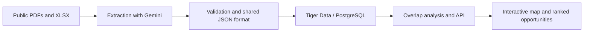

# GridLock

Find coordination opportunities across electric utilities' construction plans.

GridLock is a four-person, approximately 12-hour hackathon project for the
**Sperry Tech + Gemini API + Tiger Data** tracks. It aims to compare public plans
from Dominion Energy South Carolina and Georgia Power, highlight nearby projects,
and help users investigate opportunities to share resources and infrastructure.

## Current status

Planning and data preparation. The repository contains challenge documents,
source PDFs, a supplied spreadsheet, and team documentation. The application,
database integration, and deployment are not implemented yet. The features and
architecture below describe the intended MVP.

## Planned MVP

- An interactive map showing planned projects from both utilities.
- Geographic overlap detection for cross-utility projects within 25 miles.
- Construction timeline comparison as a secondary coordination signal.
- A ranked list of opportunities with source evidence and visible uncertainty.

A rough cost or impact estimate for one opportunity is a stretch goal. A flagged
pair indicates a potential opportunity, not proof that resource sharing is feasible.

## Selected tracks

| Track | Intended role |
| --- | --- |
| Sperry Tech | Defines the utility coordination problem and required outcomes |
| Gemini API | Helps extract structured project information from public documents; may explain validated results |
| Tiger Data | Stores project records in PostgreSQL and supports queries for analysis and the interface |

Gemini output will be checked against source evidence. Distances and rankings will
be calculated deterministically. Sponsor submission requirements still need to be
verified before submission.

## Planned data flow

The shared format preserves source references, location quality, and missing data.
Construction start, construction end, and in-service date are separate fields;
an in-service date alone does not establish a construction window.

## Technology direction

| Layer | Direction | Status |
| --- | --- | --- |
| Frontend | React + Tailwind CSS | Proposed |
| Map | Leaflet or Mapbox GL JS | Decision pending |
| Backend | Python + FastAPI | Proposed |
| Database | Tiger Data / PostgreSQL | Selected; setup pending |
| AI | Gemini API | Selected; integration pending |
| Geographic queries | PostGIS if supported by the actual instance; otherwise an agreed Python approach | Verification and decision pending |
| API testing | Postman | Team preference |
| Version control | GitHub | Team preference |
| Deployment | Vercel frontend; Render or Railway backend | Proposed; decision pending |

Choose only the dependencies needed for the demo. See [context.md](context.md)
for detailed proposals and open decisions.

## Team

| Team member | Initial responsibilities |
| --- | --- |
| Piero Espinoza | Data science: retrieve, extract, prepare, and validate PDF/XLSX data |
| Boris Steeven Mino | Data engineering: storage, imports, and database queries; shared backend/API development and Postman testing |
| Adrian Perez | Shared backend/API development and integration with Boris |
| Diego Rios | Frontend: interactive map, project details, and opportunity views |

Responsibilities are flexible as the project progresses. Coordinate task ownership
and shared interfaces before making overlapping changes.

## Repository guide

| Path | Purpose |
| --- | --- |
| [Challenge Docs/](Challenge%20Docs/) | Challenge brief, location guide, supplied workbook, and utility source PDFs |
| [context.md](context.md) | Requirements, proposed shared data contract, architecture decisions, and 12-hour plan |
| [AGENTS.md](AGENTS.md) | Team and coding-agent working agreement, approval boundaries, and PR format |
| [skills.md](skills.md) | Workflows and handoffs for extraction, storage, analysis, API, frontend, and demo |
| [docs/data-audit.md](docs/data-audit.md) | Read-only audit and proposed import mapping for the supplied workbook |

Use public information only and preserve original source files. The source
inventory and review status are tracked in [context.md](context.md).

## Getting started

1. Read the [challenge brief](Challenge%20Docs/ShellHacks_Challenge_Gridlock.pdf).
2. Review [context.md](context.md), especially the shared project-data format.
3. Read [AGENTS.md](AGENTS.md) and agree on the task you own.
4. Follow the relevant workflow in [skills.md](skills.md).

There are no application setup or run commands yet. Add verified installation,
environment configuration, local run, and deployment instructions as those
components are implemented. Never commit API keys, database credentials, or .env files.

## Contributing during the hackathon

Keep changes focused and PRs quick to review. Use a title such as
`feat: import validated utility projects`, include the PR body from
[AGENTS.md](AGENTS.md), and request one teammate review before merging.
Agree on shared schema, API, dependency, and deployment changes before applying
them. Prioritize a working end-to-end demo over optional features.
